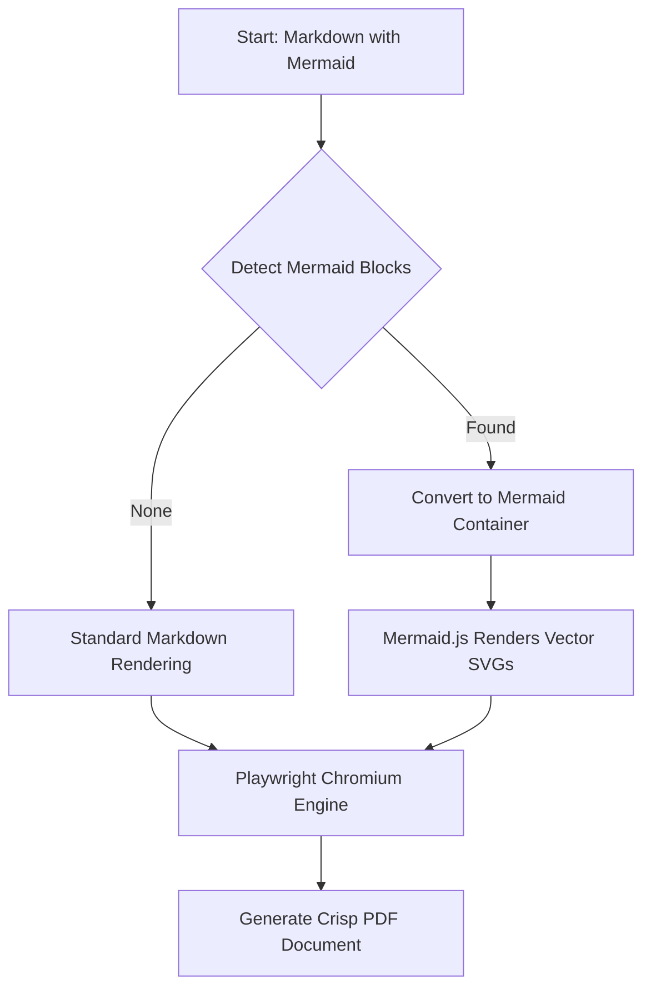
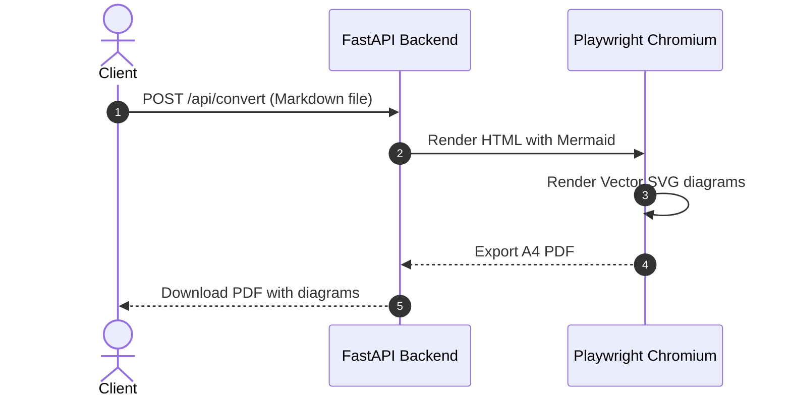

# Project Architecture & Flow

This document demonstrates markdown-to-pdf conversion with Mermaid flowchart support.

## Process Flowchart

```mermaid
flowchart TD
    A[Start: Markdown with Mermaid] --> B{Detect Mermaid Blocks}
    B -->|Found| C[Convert to Mermaid Container]
    B -->|None| D[Standard Markdown Rendering]
    C --> E[Mermaid.js Renders Vector SVGs]
    D --> F[Playwright Chromium Engine]
    E --> F
    F --> G[Generate Crisp PDF Document]
```

## Sequence Workflow

```mermaid
sequenceDiagram
    autonumber
    actor Client
    participant API as FastAPI Backend
    participant Converter as Playwright Chromium
    Client->>API: POST /api/convert (Markdown file)
    API->>Converter: Render HTML with Mermaid
    Converter->>Converter: Render Vector SVG diagrams
    Converter-->>API: Export A4 PDF
    API-->>Client: Download PDF with diagrams
```
